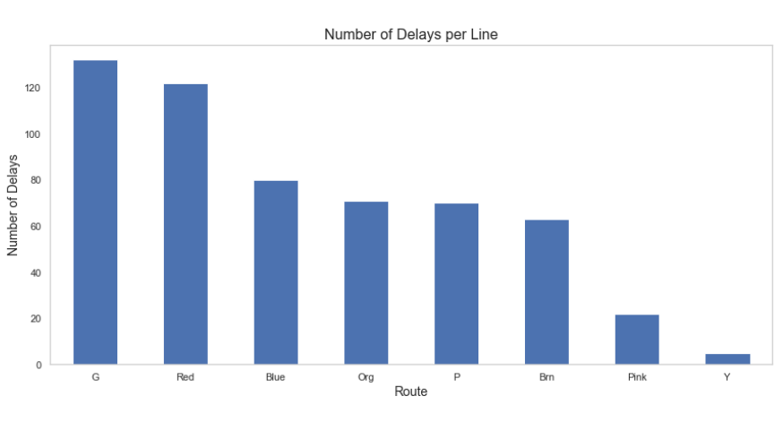
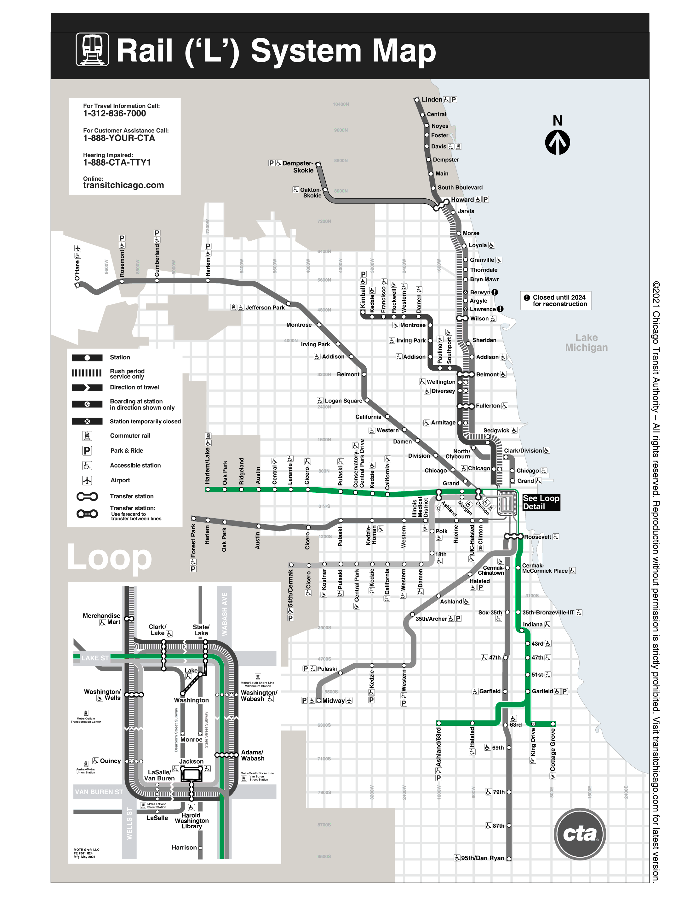
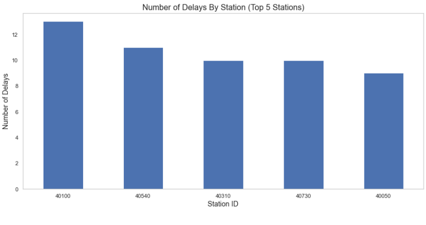
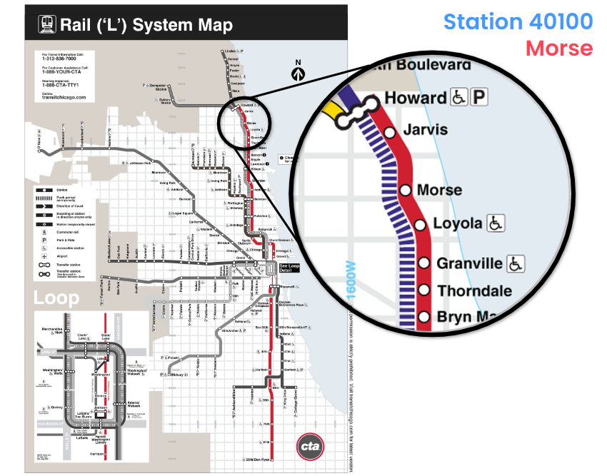
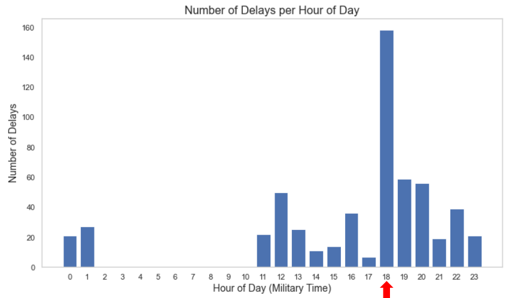

# Predictive Service Delay Management for CTA Trains

# Overview of Business Problem and Project 

Chicago has the second-largest transit system in the United States, and yet, it is still plagued with constant delays. The goal of this project is to arrive at a functioning predictive model to predict delays for commuting trains in Chicago. 

# Data Limitations

There was no access to historical data for this project, and also no access to a cloud server where it was possible to run the script 24/7 to collect data for every hour.

# Data Analysis

The Green Line has the most occurences of delayed trains.

This is the Green Line.

Station 40100 has the most delays recorded.

Station 40100 is Morse, which is highlighted here.

6 PM CST is the hour with the most occurences of delayed trains.

# Selected Model

Decision Tree

* 11.85% precision
* 14.04% recall
* F1-score of 0.113

# Conclusion and Future Insights 

The best-performing model that came out of this project, has subpar precision, recall, and F1-score. However, this is an iterative process and I will continue finetuning hyperparameters to improve the performance of this model and hopefully deploy it on an app. Nonetheless, there are several recommendations to the commuters of Chicago:

* Prepare in advance
* Download available train-tracking apps
* Use alternative commuting methods, such as biking
